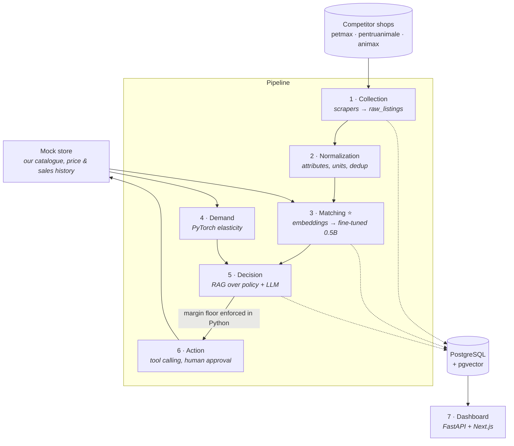

# PricePilot

**Competitive pricing intelligence for an online pet-supplies shop.**

Shops change their prices every day. Nobody knows which of a competitor's listings is the
same product as one of yours, because no shared product code exists — the same bag of dog
food is written differently by every shop, and the 4.5 kg bag is a completely different
product from the 12 kg bag despite near-identical titles. PricePilot collects competitor
prices daily, works out automatically which listing corresponds to which of our products,
estimates how much demand responds to price, and recommends a new price with a written
justification and a hard margin floor that no model can talk its way past.

> **Status: Phase 0 (foundation) and Phase 2 (normalization) closed; Phase 1 (collection) gate
> fully met — closed 2026-09-22; Phase 3 (matching) in progress, items 1-7 done, at item 8
> (quantized CPU serving benchmark).** Numbers below are filled in as each phase produces them, and every one of
> them is generated by a script in this repo. See `STATE.md` for live progress and
> `docs/AUDIT.md` for a critical review of the plan.

---

## Architecture



**The three things this project is built to demonstrate:** RAG with correct architectural
judgement about when *not* to use it, a fine-tune that beats a documented baseline, and a
full production deployment. The headline engineering decision is that the matching model is
a small fine-tuned LLM running **quantized on CPU** on a €4/month VPS, benchmarked against a
large hosted API model on accuracy, latency and cost per 1,000 comparisons.

## Results

| Component | Baseline | Implemented | Metric | Status |
|---|---|---|---|---|
| Candidate retrieval | — | 88.0% (44/50), Wilson 95% CI [76.2%, 94.4%] | recall@20 | Phase 3 — measurement-power finding, not "met" or "missed" (target 90% sits inside the CI) |
| Matching | cross-encoder (mmarco-mMiniLMv2, epoch-6 checkpoint of an 8-epoch fine-tune): F1 0.8737, P 0.8925 (n=93, CI [0.813, 0.941]), R 0.8557 (n=97, CI [0.772, 0.912]) | LoRA Qwen2.5-0.5B: F1 0.8796, P 0.8936 (n=94, CI [0.815, 0.941]), R 0.8660 (n=97, CI [0.784, 0.920]) — **a tie with the baseline (CIs overlap; McNemar p = 1.0)** | precision / recall / F1 on 287 TEST pairs (284 scored) | Phase 3 |
| Serving | hosted zero-shot `claude-sonnet-5`: F1 0.9036, p95 2361 ms, $1.450098/1k (zero-shot, not a fair accuracy comparison) | CE int8 on CPU: F1 0.8235 (significant drop vs fp32, McNemar p=0.0042), p95 65 ms, $0.000153/1k · LoRA served as ONNX fp32 CPU (no int8 variant was eligible): F1 0.8750, p95 2242 ms, $0.007104/1k | p50/p95 latency, $/1k comparisons | Phase 3 — [full table](docs/learned/phase3-serving-benchmark.md) |
| Demand | naive 7-day average | PyTorch | MAE / MAPE, elasticity recovery error | Phase 4 |
| Recommendations | — | RAG + guardrail | margin violations (must be 0) | Phase 5 |

*Every cell is produced by a script in this repo and reproducible with one command. Empty
cells are empty because the work has not been done — not because the number was bad.*

## Dataset

The matching dataset is **hand-labelled, not generated, and FROZEN**: 997 decisions by one
annotator (M match 354 / N no-match 634 / S skip 9) over 959 distinct pairs drawn from three
Romanian pet-shop catalogues, deliberately including hard negatives (same line, different
size/flavour/life stage). **Frozen 2026-09-22, SHA-256
`540a4fd6ccfc52525014ac770caadbf544243dccc5a85d3fcb279fd7d052eed4`** (`tests/test_labels_frozen.py`)
— no label changes after this point without a reason recorded in `STATE.md` first.

- **Split is product-level** (no listing appears on both sides): **TEST 300 rows / 287 distinct
  pairs**, **TRAIN_VAL 697 rows / 672 distinct pairs**.
- **TEST is blind**: no rules-engine suggestion was ever shown while labelling it — true for all
  287 pairs, enforced three independent ways, and mechanically unaffected by the next point.
  **One TEST pair carries a disclosed label-provenance exception, not a blindness exception:**
  `3f574dad8b6e_b52acad20816_0`'s label rests on a
  2026-09-21 revision that DECISIONS.md ADR-0028 addendum #15 judged to rest on an invalid ground
  (rule 1 reads the title, and both titles say "pisici"/cat; the stored `species` field disagrees,
  a known `normalize/species.py` defect). That revision was **never re-examined** — a tool defect
  in `tools/annotate.html`'s review mode silently skipped it while reporting all other queued
  pairs done (fixed; see `docs/learned/phase3-freeze-acknowledgements.json`). Once the defect was
  found, the annotator was asked and **explicitly decided to let the label stand rather than
  reopen it**, recorded verbatim in that file — this is a stated limitation on 1 of 287 TEST
  pairs, not a re-decision that happened. The other 286 TEST pairs carry no such caveat. TRAIN_VAL
  is **assisted** (a suggestion is shown; the annotator overrode it on 96/697 = 13.8% of pairs).
- Four pairs the checker's `trivial_spot_check_not_M` rule flags (all in TRAIN_VAL) are labelled
  `N` despite that tier's "trivially the same" assumption; the mechanical consistency checker still
  flags them, and the annotator's `N` stands as a deliberate decision — the checker never overrides
  the annotator (`docs/learned/phase3-freeze-acknowledgements.json`). Three of the four are repeats
  that `docs/learned/phase3-eval-view.json` attributes to `proxy_key_collision` by its own
  repeat-resolution rule, so that file's own `trivial_spot_check` row shows only 1 N, not 4 — both
  counts are correct under their own definitions.
- 38 pairs were shown twice as a self-consistency check: agreement TEST 13/13, TRAIN_VAL 22/25 (pre-reconciliation, measured at ingest 2026-09-21; the review pass resolved the 3 disagreements).
  **Qualifier:** all 38 repeated pairs are exactly the `trivial_spot_check` pairs (near-identical
  titles), so these numbers measure consistency on the easiest pairs in the dataset, not on the
  hard negatives — TRAIN_VAL's 22/25 is more informatively read as a **12% self-disagreement rate
  on trivially easy pairs**.
- Reproduce: `uv run python scripts/ingest_labels.py` (QA report: `docs/learned/phase3-label-qa-20260922.md`),
  `uv run python scripts/check_label_rule_consistency.py`, `uv run python scripts/freeze_labels.py`
  (reports frozen/unfrozen status, never re-freezes).

| Component | Baseline (cross-encoder) | Fine-tuned 0.5B (LoRA) | Metric |
|---|---|---|---|
| Matching, TEST (287 pairs, 284 scored) | F1 0.8737; P 0.8925 (n=93, 95% CI [0.813, 0.941]); R 0.8557 (n=97, CI [0.772, 0.912]) | F1 0.8796; P 0.8936 (n=94, CI [0.815, 0.941]); R 0.8660 (n=97, CI [0.784, 0.920]) — statistically a tie (McNemar 8 vs 9 discordant, p = 1.0000) | precision / recall / F1 |
| — size variant (capacity-differs tiers, n=85, 1 positive) | 83/85 correct (0.976, CI [0.918, 0.994]); F1 undefined | 82/85 correct (0.965, CI [0.901, 0.988]); F1 undefined | correct calls / n |
| Serving on CPU (item 8) | CE int8: F1 0.8235, p95 65 ms, $0.000153/1k, 627 MB peak RSS | LoRA ONNX fp32 CPU: F1 0.8750, p95 2242 ms, $0.007104/1k, 2347 MB peak RSS (served; no int8 variant was eligible, protocol 5.11) | p50 / p95 latency, $/1k |

Full breakdown, both recall readings, per-tier results and the zero-shot comparison point:
`docs/learned/phase3-baseline-results.md`. Full serving benchmark, hosted v1/v2, LoRA int8 finding,
K=20/K=100 VPS wall-clock: `docs/learned/phase3-serving-benchmark.md`.

*Reproduce: `uv run python scripts/compare_models.py` (full comparison, McNemar, per-tier);
`uv run python scripts/build_serving_table.py` (serving table). No number appears here without a
script behind it.*

## What this system does NOT do

- **It is not multi-tenant and has no user accounts.** One shop, one admin.
- **It does not integrate with a real store.** `services/mock_store` stands in for
  Shopify/WooCommerce, exposing the same shape of API a real integration would target.
- **It does not use real sales data.** Prices and promotions are genuinely collected from
  live shops; the *sales* series is simulated on top, because no retailer publishes theirs.
  The split is stated explicitly in `docs/learned/demand-model.md`.
- **It does not touch regulated products.** Veterinary medicines, antiparasitics and
  prescription diets are filtered out at ingest.
- **It does not change prices on its own by default.** Every recommendation needs human
  approval, and the margin floor is a Python `if` statement, not a line in a prompt.

## Local setup

```bash
cp .env.example .env          # 1. fill in nothing for local dev; defaults work
make install                  # 2. uv sync --extra dev
make up && make migrate       # 3. Postgres + pgvector, API on :8000, mock store on :8001
```

Then `make status` for live project state, `make check` for lint + types + tests.

On Windows, `make` is not installed — use `.\make.ps1 <target>`, which mirrors every target.

## Repo map

| Path | What |
|---|---|
| `src/pricepilot/` | The pipeline: config, db, models, API, LLM client |
| `services/mock_store/` | Fixture standing in for our own shop |
| `scripts/status.py` | `make status` — every number queried, never hand-written |
| `alembic/` | Migrations |
| `docs/AUDIT.md` | Blunt critical review of this project's own plan |
| `docs/learned/` | Short write-ups of each ML/RAG component and why it was built that way |
| `STATE.md` · `DECISIONS.md` · `docs/COSTS.md` | Live state, ADRs, spend ledger |

## Demo

A short GIF goes here once Phase 7 is deployed.
