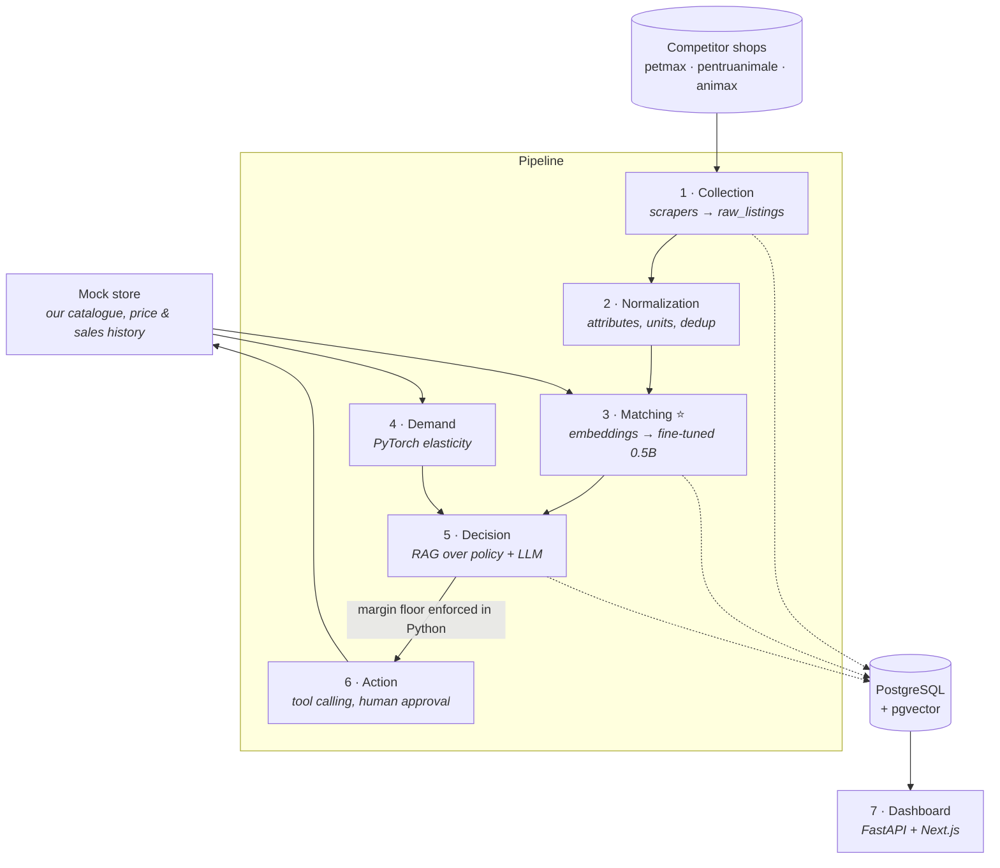

# PricePilot

**Competitive pricing intelligence for an online pet-supplies shop.**

Shops change their prices every day. Nobody knows which of a competitor's listings is the
same product as one of yours, because no shared product code exists — the same bag of dog
food is written differently by every shop, and the 4.5 kg bag is a completely different
product from the 12 kg bag despite near-identical titles. PricePilot collects competitor
prices daily, works out automatically which listing corresponds to which of our products,
estimates how much demand responds to price, and recommends a new price with a written
justification and a hard margin floor that no model can talk its way past.

> **Status: Phase 0 (foundation) complete.** No results table yet — the numbers below are
> filled in as each phase produces them, and every one of them is generated by a script in
> this repo. See `STATE.md` for live progress and `docs/AUDIT.md` for a critical review of
> the plan.

---

## Architecture



**The three things this project is built to demonstrate:** RAG with correct architectural
judgement about when *not* to use it, a fine-tune that beats a documented baseline, and a
full production deployment. The headline engineering decision is that the matching model is
a small fine-tuned LLM running **quantized on CPU** on a €4/month VPS, benchmarked against a
large hosted API model on accuracy, latency and cost per 1,000 comparisons.

## Results

| Component | Baseline | Implemented | Metric | Status |
|---|---|---|---|---|
| Candidate retrieval | — | — | recall@20 | Phase 3 |
| Matching | classical cross-encoder | fine-tuned 0.5B (LoRA) | precision / recall / F1 | Phase 3 |
| Serving | hosted API model | quantized 0.5B on CPU | p50/p95 latency, $/1k | Phase 3 |
| Demand | naive 7-day average | PyTorch | MAE / MAPE, elasticity recovery error | Phase 4 |
| Recommendations | — | RAG + guardrail | margin violations (must be 0) | Phase 5 |

*Every cell is produced by a script in this repo and reproducible with one command. Empty
cells are empty because the work has not been done — not because the number was bad.*

## What this system does NOT do

- **It is not multi-tenant and has no user accounts.** One shop, one admin.
- **It does not integrate with a real store.** `services/mock_store` stands in for
  Shopify/WooCommerce, exposing the same shape of API a real integration would target.
- **It does not use real sales data.** Prices and promotions are genuinely collected from
  live shops; the *sales* series is simulated on top, because no retailer publishes theirs.
  The split is stated explicitly in `docs/learned/demand-model.md`.
- **It does not touch regulated products.** Veterinary medicines, antiparasitics and
  prescription diets are filtered out at ingest.
- **It does not change prices on its own by default.** Every recommendation needs human
  approval, and the margin floor is a Python `if` statement, not a line in a prompt.

## Local setup

```bash
cp .env.example .env          # 1. fill in nothing for local dev; defaults work
make install                  # 2. uv sync --extra dev
make up && make migrate       # 3. Postgres + pgvector, API on :8000, mock store on :8001
```

Then `make status` for live project state, `make check` for lint + types + tests.

On Windows, `make` is not installed — use `.\make.ps1 <target>`, which mirrors every target.

## Repo map

| Path | What |
|---|---|
| `src/pricepilot/` | The pipeline: config, db, models, API, LLM client |
| `services/mock_store/` | Fixture standing in for our own shop |
| `scripts/status.py` | `make status` — every number queried, never hand-written |
| `alembic/` | Migrations |
| `docs/AUDIT.md` | Blunt critical review of this project's own plan |
| `docs/learned/` | Short write-ups of each ML/RAG component and why it was built that way |
| `STATE.md` · `DECISIONS.md` · `docs/COSTS.md` | Live state, ADRs, spend ledger |

## Demo

A short GIF goes here once Phase 7 is deployed.
